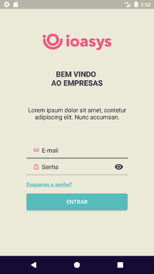
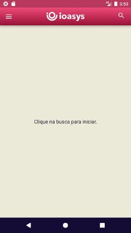
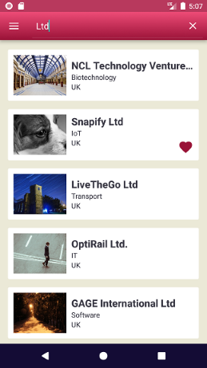
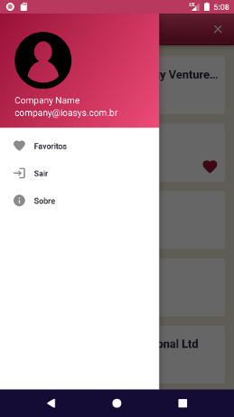

# Project Empresas (ioasys bootcamp)

App developed during ioasys bootcamp 2021. Made to consolidate what was learned and being evaluated for the second phase of the camp.

## Screenshots

## Libraries

* [DataBinding](https://developer.android.com/topic/libraries/data-binding/)
* [ViewModel](https://developer.android.com/topic/libraries/architecture/viewmodel)
* [LiveData](https://developer.android.com/topic/libraries/architecture/livedata)
* [Retrofit](https://square.github.io/retrofit/)
* [OkHttp](https://github.com/square/okhttp)
* [Room](https://developer.android.com/topic/libraries/architecture/room)
* [Glide](https://bumptech.github.io/glide/)
* [Koin](https://insert-koin.io/)

## How to build

This is a simple Android Studio project, so you only need to open it and build. The only thing you need is the ioasys credentials to login. 

If you want to change API endpoint, you need to configure `BASE_URL` in `build.gradle`. The default API works with custom headers to proceed others requests.

## Next improvements
* Implement unit tests
* Add and remove favorites by swiping left/right
* Remember login option if token still valid
* Implement multi delete selection
* Implement ordering if favorites

## References
* [developer.android.com](developer.android.com)
* [data binding library](developer.android.com/topic/libraries/data-binding)
* [view model class](https://developer.android.com/topic/libraries/architecture/viewmodel)
* [mvvm pattern](https://upday.github.io/blog/model-view-controller/)
* [insert-koin.io](insert-koin.io)
